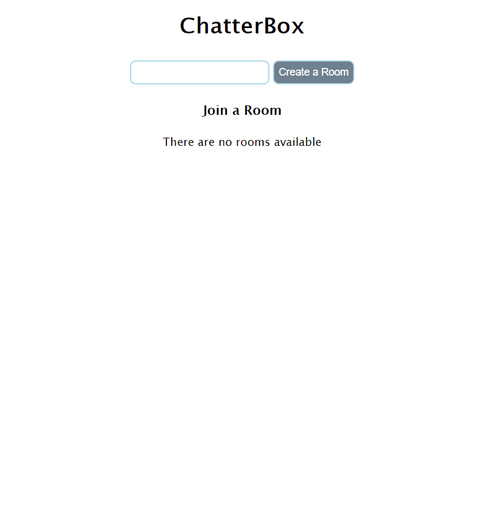

# chatter-box
A full stack web application where users can create chat rooms and send messages in real time

Responsive design suited for mobile and desktop

## Technologies Used

- Vanilla JS
- EJS
- Node JS
- Express JS
- Socket.io
- HTML5
- CSS3

## Live Demo

Try the application live at [https://chatter-box.uzairashraf.dev/](https://chatter-box.uzairashraf.dev/)

## Features

- User can create a chat room
- User can enter a custom username
- User can connect to a chat room
- User can send messages in real time
- User can disconnect from a chat room
- User can recieve notifications


## Preview




## Development

#### System Requirements

- NPM 6 or higher
- Node 10 or higher

#### Getting Started

1. Clone the repository.

    ```shell
    git clone https://github.com/uzair-ashraf/chatter-box.git
    cd chatter-box
    ```

1. Install all dependencies with NPM.

    ```shell
    npm install
    ```

1. Start node server. Once started you can view the application by opening http://localhost:3000 in your browser.

    ```shell
    npm start
    ```
